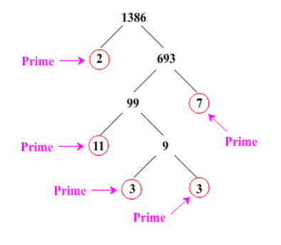
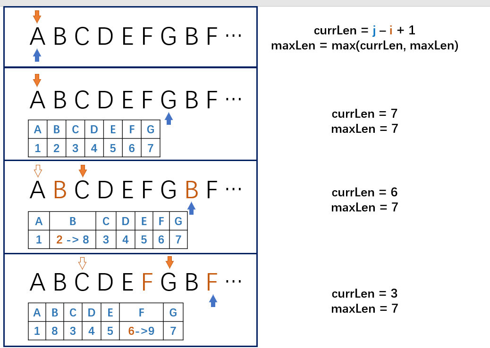

[TOC]

# Review List

## Questions List

| rank | web name | question name                                     | algorithm                         | category                                  |
| ---- | -------- | ------------------------------------------------- | --------------------------------- | ----------------------------------------- |
| 1    | leetcode | 26. Remove Duplicates from Sorted Array           | two pointers                      | move in array                             |
| 0    | leetcode | 122. Best Time to Buy and Sell Stock II           | no                                | no                                        |
| 3    | leetcode | 189. Rotate Array                                 | Josephus Problem                  | move in array / rotate in array           |
| 0    | leetcode | 217. Contains Duplicate                           | no                                | no                                        |
| 1    | leetcode | 136. Single Number                                | math                              | duplicate s in array                      |
|      | leetcode | 66. Plus One                                      | no                                | no                                        |
| 0    | leetcode | 350. Intersection of Two Arrays II                | no                                | no                                        |
| 1    | leetcode | 283. Move Zeroes                                  | two pointers                      | move in array                             |
| 1    | leetcode | 1. Two Sum                                        | `HashMap` to remember information | two or more elements interaction in array |
| 2    | leetcode | 48. Rotate Image                                  | rotate                            | rotate in 2D                              |
| 1    | leetcode | 36. Valid Sudoku                                  | nested data structure             | 2D                                        |
| 0    | leetcode | 344. Reverse String                               | no                                | no                                        |
| 0    | leetcode | 7. Reverse Integer                                | no                                | no                                        |
| 1    | leetcode | 387. First Unique Character in a String           | alphabet array                    | alphabet array                            |
| 0    | leetcode | 242. Valid Anagram                                | no                                | no                                        |
| 0    | leetcode | 125. Valid Palindrome                             | no                                | no                                        |
| 0    | leetcode | 8. String to Integer (atoi)                       | no                                | no                                        |
| 0    | leetcode | 38. Count and Say                                 | no                                | no                                        |
| 1    | leetcode | 14. Longest Common Prefix                         | predefine answer                  | predefine answer                          |
| 1    | leetcode | 21. Merge Two Sorted Lists                        | invisible head node               | linked list                               |
| 0    | leetcode | 234. Palindrome Linked List                       | slow-quick pointers               | linked list                               |
| 0    | leetcode | 141. Linked List Cycle                            | slow-quick pointers               | linked list                               |
| 0    | leetcode | 19. Remove Nth Node From End of List              | slow-quick pointers               | linked list                               |
| 0    | leetcode | 237. Delete Node in a Linked List                 | no                                | linked list                               |
| 3    | leetcode | 204. Count Prime                                  | Eratosthenes                      | Prime                                     |
| 3    | leetcode | 104. Maximum Depth of Binary Tree                 | dsf                               | binary tree                               |
| 3    | leetcode | 98. Validate Binary Search Tree                   | bst                               | binary tree                               |
| 3    | leetcode | 101. Symmetric Tree                               | bsf                               | binary tree                               |
| 3    | leetcode | 102. Binary Tree Level Order Traversal            | bsf                               | binary tree                               |
| 3    | leetcode | 108. Convert Sorted Array to Binary Search Tree   | bst                               | binary tree                               |
| 0    | leetcode | 88. Merge Sorted Array                            | no                                | no                                        |
| 1    | leetcode | 278. First Bad Version                            | Dichotomy                         | find a certain value                      |
| 1    | leetcode | 15. 3Sum                                          | no                                | no                                        |
| 1    | leetcode | 73. Set Matrix Zeroes                             | no                                | replace in-place                          |
| 1    | leetcode | 49. Group Anagrams                                | prime factorization               | prime                                     |
| 3    | leetcode | 3. Longest Substring Without Repeating Characters | `HashMap` to remember information | two or more elements interaction in array |
| 3    | leetcode | 5. Longest Palindromic Substring                  | extend from known part            | palindrome                                |
| 2    | leetcode | 334. Increasing Triplet Subsequence               | remember array information        | two or more elements interaction in array |
| 0    | leetcode | 163. Missing Ranges                               | no                                | no                                        |
| 1    | leetcode | 2. Add Two Numbers                                | invisible head node               | no                                        |
| 1    | leetcode | 328. Odd Even Linked List                         | three pointers                    | change order of linked list               |
| 3    | leetcode | 160. Intersection of Two Linked Lists             | Möbius band                       | intersection                              |


## Algorithm List

| algorithm           | relative questions                    | code                                                         | explanation                                    | description                                                  |
| ------------------- | ------------------------------------- | ------------------------------------------------------------ | ---------------------------------------------- | ------------------------------------------------------------ |
| Josephus Problem    | 189. Rotate Array                     | [java version](/java/src/Rotate/Rotate_Array.java)           | [java version](/java/src/Prime/Prime.MD)       | 类似于十一抽杀律 decimation, which is used to rotate continuous elements in an array. |
| Eratosthenes        | 204. Count Prime                      | [java version](/java/src/Prime/Eratosthenes.java)            |                                                | count the number of prime before a certain value             |
| Möbius band         | 160. Intersection of Two Linked Lists | [java version](/java/src/MobiusBand/Intersection_of_Two_Linked_List.java) | [java version](/java/src/MobiusBand/Mobius.ms) |                                                              |
| bit manipulation    | 461. Hamming Distance                 |                                                              |                                                |                                                              |
| prime factorization | 49. Group Anagrams                    |                                                              |                                                |                                                              |
| Tree                |                                       |                                                              |                                                |                                                              |
| Dichotomy           |                                       |                                                              |                                                |                                                              |


## Tips Review List

| tips                | relative questions                             | review date |
| ------------------- | ---------------------------------------------- | ----------- |
| invisible head node | 21. Merge Two Sorted Lists, 2. Add Two Numbers |             |
|                     |                                                |             |
|                     |                                                |             |

### invisible head node

#### explanation

```java
ListNode head = new ListNode(); // we create a head first
ListNode curr = head;
// when we need to add a node
curr.next = new ListNode();
// we return
head.next;
// so there is no "tail" at the end of this list;
```


# Relative Knowledge

An **iterative** function is one that loops to repeat some part of the code, and a **recursive** function is one that calls itself again to repeat the code.

# Data Structure

## Binary Tree

### traversal

- [Inorder, Preorder, Postorder](https://www.geeksforgeeks.org/tree-traversals-inorder-preorder-and-postorder/)
- [perfect binary tree](https://en.wikipedia.org/wiki/Binary_tree#:~:text=A%20perfect%20binary%20tree%20is,one%20mother%20and%20one%20father).

### type

- [binary search tree](https://en.wikipedia.org/wiki/Binary_search_tree)

## Graph

### traversal

infect algorithm

# General Algorithm

## Unique Prime Multiplication

### Intro



The **Fundamental Theorem of Arithmetic** states that every natural number greater than 1 can be written as a product of prime numbers.

In computing algorithm, it can be utilized to acquire the eigenvalue of a "string" regardless of the position of each "character". So, "abc" and "bca" could get the same eigenvalue via Unique Prime Multiplication.

### caveat

- the range of this eigenvalue might be larger than the max bound of the integer.

### example

| website  | No.                |
| -------- | ------------------ |
| LeetCode | 49. Group Anagrams |
|          |                    |
|          |                    |

# Specific for the questions

## Update the Range Along the Array

### Intro

Image you have a Character String and you need to find the longest substring within in without any redundant character.



- The blue arrow will traverse the entire `String` character by character.
- The red arrow will check the table and decide whether move forward or not, when the position of the nearest repeating character of the letter that the blue arrow points to is larger, than the red arrow will move forward.
- In this way the blue arrow always points to the end of the satisfied substring and the red arrow resides at the beginning.
- The table will be updated, recording the next position of the nearest repeating character of the letter that the blue arrow points to
- the max length of the substring will also be update following the movement of the blue arrow

### example

| website  | No.                                               |
| -------- | ------------------------------------------------- |
| LeetCode | 3. Longest Substring Without Repeating Characters |
|          |                                                   |


## Increasing Triplet Subsequence

### Intro

Given an integer array `nums`, return `true` *if there exists a triple of indices* `(i, j, k)` *such that* `i < j < k` *and* `nums[i] < nums[j] < nums[k]`. If no such indices exists, return `false`.

- The `j` is the crucial one, because when we find a value larger than `j` we actually get the point.
- So, we need to keep `j` to be as smaller as possible, in order to achieve it, try to update `j` regarding `i`. 

### example

| website  | No.                                 |
| -------- | ----------------------------------- |
| LeetCode | 334. Increasing Triplet Subsequence |

## Missing Ranges

### Intro

You are given an inclusive range [lower, upper] and a sorted unique integer array `nums`, where all elements are in the inclusive range.

A number x is considered missing if x is in the range [lower, upper] and x is not in `nums`.

Return the smallest sorted list of ranges that cover every missing number exactly. That is, no element of `nums` is in any of the ranges, and each missing number is in one of the ranges.

Each range [a,b] in the list should be output as:

```shell
"a->b" if a != b
"a" if a == b
```

- traverse the `nums`,

### example

| website  | No.                 |
| -------- | ------------------- |
| leetcode | 163. missing ranges |
|          |                     |
|          |                     |


## Find the intersection of two linked list

### Intro

- get to the same initial point of two linked list and move forward together.

### example

| website  | No.                                   |
| -------- | ------------------------------------- |
| leetcode | 160. Intersection of Two Linked Lists |
|          |                                       |


## Tree Traversal

### Intro

### method

- **Depth First Search**: Utilize `Stack` to store the Tree Node alone the left path or right path, and pop up the Tree Node to access other part of the tree. Check `94. Binary Tree In-order Traversal` to have an inspiration!!!
- **Breadth First Search**: We don't need to use `stack` if we want to save space. Check  

### example

| website  | No.                                              |
| -------- | ------------------------------------------------ |
| leetcode | 94. Binary Tree In-order Traversal               |
| leetcode | 103. Binary Tree Zigzag Level Order Traversal    |
| leetcode | 116. Populating Next Right Pointers in Each Node |

## Reconstruct Tree

### Intro

Give two array, `preorder` and `inorder`, reconstruct the tree.

### method

Traverse `preorder` from the left to the right, the first element is the root.

There are several hints

- Find the target element in the `inorder` array, all elements locates on the left side of the target element in the `inorder` array will also sit on the left side of the target element in the tree; the same as right side.

- we have a `leftBound` which indicates the left bound of the `inorder`

- `curr`  will be determined according to whether is has left wing or not. If the target element in the `inorder` has left wing (it sits on the right hand side of the `leftBound`), we will push it into the `stack`, and move one element forward in the `preorder` list, this element in the `preorder` must be the `curr`'s left child; If not, it will be tricky, check the code in `\105. Construct Binary Tree from Preorder and Inorder Traversal`

### example

| website  | No.                                              |
| -------- | ------------------------------------------------ |
| leetcode | 116. Populating Next Right Pointers in Each Node |
|          |                                                  |