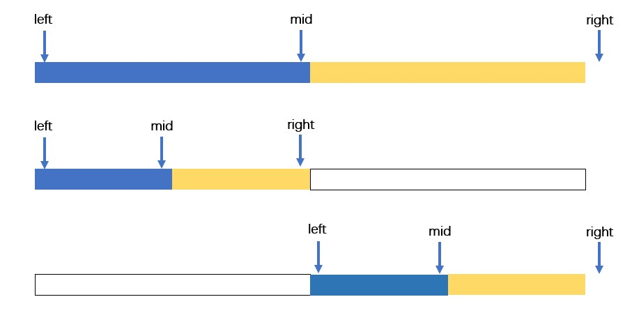

# Binary Search

## general design

We need to pay attention to some special cases,

```java
 mid
 l           r
[1,          3]
```

- we use `while(left < right)` as the condition of the loop, so pay attention to any `left = mid` snippet since it might lead to a dead loop.
- do we need to judge if `nums[mid] == target` this is always the most safe method.
- if the target didn't exist, the `l` will finally point to where? the smallest value larger than the target?
- it is wise to make the target always in the range of [l, r], so, update `l` and `r` carefully.

## classic algorithm

### result


### illustration



```java
int left = 0, right = nums.length, mid;
while(left < right){
    mid = (left + right) / 2;
    if()
}
```

