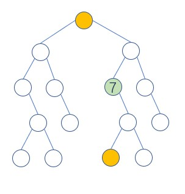

# Binary Tree Basic Algorithm

## Traverse

### DFS

[DFS code](TreeNode_Basic.java)

### in order traverse

[in order traverse code](TreeNode_Basic.java)

### pre order traverse

[pre order traverse code](TreeNode_Basic.java)

### post order traverse

[post order traverse code](TreeNode_Basic.java)

## construct

### Build alone the pre-order array

Three steps:

1. grow the left child branch
   - when need to stop? when do we reach the leaf node?
2. trace back (use stack)
   - when do we reach the "valid node", here node 2 is a "valid node" since it need to assemble the right child node and node 5 need to be skipped since it has no right child to extend.
3. add the right node on the "valid node" and start a new loop.

#### pre-order and in-order

Build along the pre-order array and direct by the in-order array.

[code](Construct_Binary_Tree_from_Preorder_and_Inorder_Traversal.java)

#### pre-order and post-order

Build along the pre-order array and direct by the post-order array.

[code](Construct_Binary_Tree_from_Preorder_and_Postorder_Traversal.java)

### Build alone the post-order array

The same as pre-order, three steps:

1. grow the right child branch
   - when need to stop? when do we reach the leaf node?
2. trace back (use stack)
   - when do we reach the "valid node", here node 2 is a "valid node" since it need to assemble the left child node and node 5 need to be skipped since it has no left child to extend.
3. add the left node on the "valid node" and start a new loop.

#### post-order and in-order

[code](Construct_Binary_Tree_from_Postorder_and_Inorder_Traversal.java)

# Binary Search Tree

## successor

the successor of a certain node is either in his parents or in the descending of his right child.

[code](Inorder_successor_in_BST.java)

