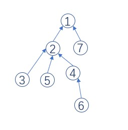
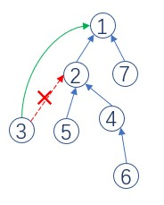
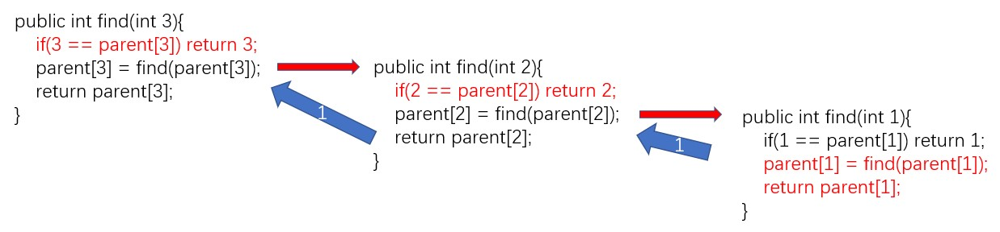
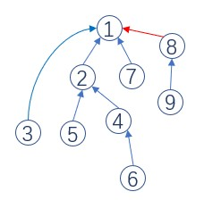

# Template

## initialize

`rank` array stands for the depth of the node in the tree, `parnent` array represents their parent nodes.



```java
node:   [1, 2, 3, 4, 5, 6, 7];
rank:   [0, 1, 2, 2, 2, 3, 1];
parent: [1, 1, 2, 2, 2, 4, 1];
```


## find and compress




```java
public int find(int x){
    if(x == parent[x]) return x;
    parent[x] = find(parent[x]); // compress
    return parent[x];
}
```

if we use `find(3)`, the path from node 3 to node 1 is compressed. Explain the recursion.




## merge



If we have a new branch, node(8) - node(9), we need to merge new branch to old one since the rank of new is lower than the old.

```java
public void union(int x, int y){
    // find their root;
    int rootX = find(x), rootY = find(y);
    if(rootX = rootY) return;
    if(rank[rootX] <= rank[rootY]) parent[rootX] = rootY;
    else parent[rootY] = rootX;
    if(rank[rootX] == rank[rootY]){
        rank[rootX]++;
    }
}
```

